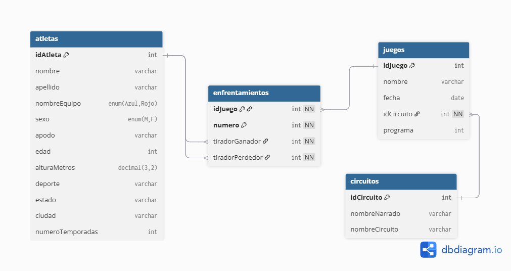

# Base de datos Exatlón México

## 📝 Descripción
En este proyecto se almacena la información de cada una de las carreras de la novena temporada del Reality Deportivo llamado *Exatlón México*. 

## 🗺️ Modelo de Datos
El modelo entidad relación que le da estructura a la base es el siguiente:



> Fue contruido mediante el código establecido en el sitio [dbdiagram](https://dbdiagram.io/home)

## 📁 Estructura del Proyecto
- El **código SQL** para el esquema de la base se encuentra [aqui](./Exatlón%20Squema.sql)
- El código para insertar los registros de la base está [aqui](./Exatlón%20Data.sql)
- He generado 8 diferentes preguntas con su respectiva respuesta en lenguaje SQL en el archivo [Preguntas](./Preguntas.sql)

## 📊 Ejemplo de Análisis
Con esta base datos podemos responder preguntas como **¿Cuál es el porcentaje de victorias de cada atleta?** y confirmar si corresponde con lo que presenta el reality los domingos.

### Código de ejemplo:
```sql
WITH victorias AS (
    SELECT 
        tiradorGanador,
        COUNT(tiradorGanador) AS Victorias
    FROM 
        enfrentamientos 
        JOIN juegos USING(idJuego)
    WHERE 
        juegos.nombre NOT IN ('Eliminación')
        AND idJuego <= 25
    GROUP BY tiradorGanador
), 
derrotas AS(
    SELECT 
        tiradorPerdedor,
        COUNT(tiradorPerdedor) AS Derrotas
    FROM 
        enfrentamientos 
        JOIN juegos USING(idJuego)
    WHERE 
        juegos.nombre NOT IN ('Eliminación')
        AND idJuego <= 25
    GROUP BY tiradorPerdedor
)

SELECT 
    a.nombre,
    a.apellido,
    Victorias,
    Derrotas,
    CONCAT( ROUND(Victorias / (Victorias + Derrotas) * 100, 0), '%' )AS `%V`
FROM 
    atletas AS a 
    LEFT JOIN victorias AS v 
        ON a.idAtleta = v.tiradorGanador
    LEFT JOIN derrotas AS d 
        ON a.idAtleta = d.tiradorPerdedor
WHERE 
    a.sexo = 'F' 
    AND a.nombreEquipo = 'Azul'
ORDER BY `%V` DESC;
```

## 🛠️ Habilidades Demostradas
1. Modelado de datos.
2. Consultas SQL usando sentencias SELECT, FROM, WHERE.
3. Cruce de información entre diferentes tablas.
4. Agrupamiento, ordenación, funciones.
5. Subconsultas, tablas derivadas, CTE's.